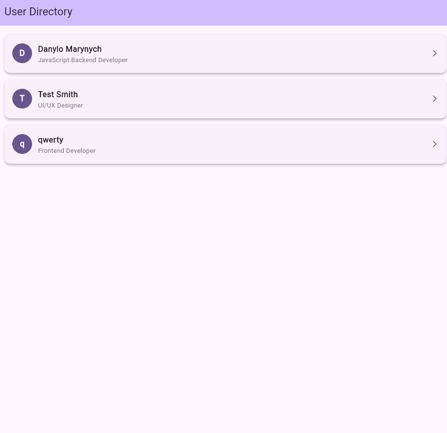
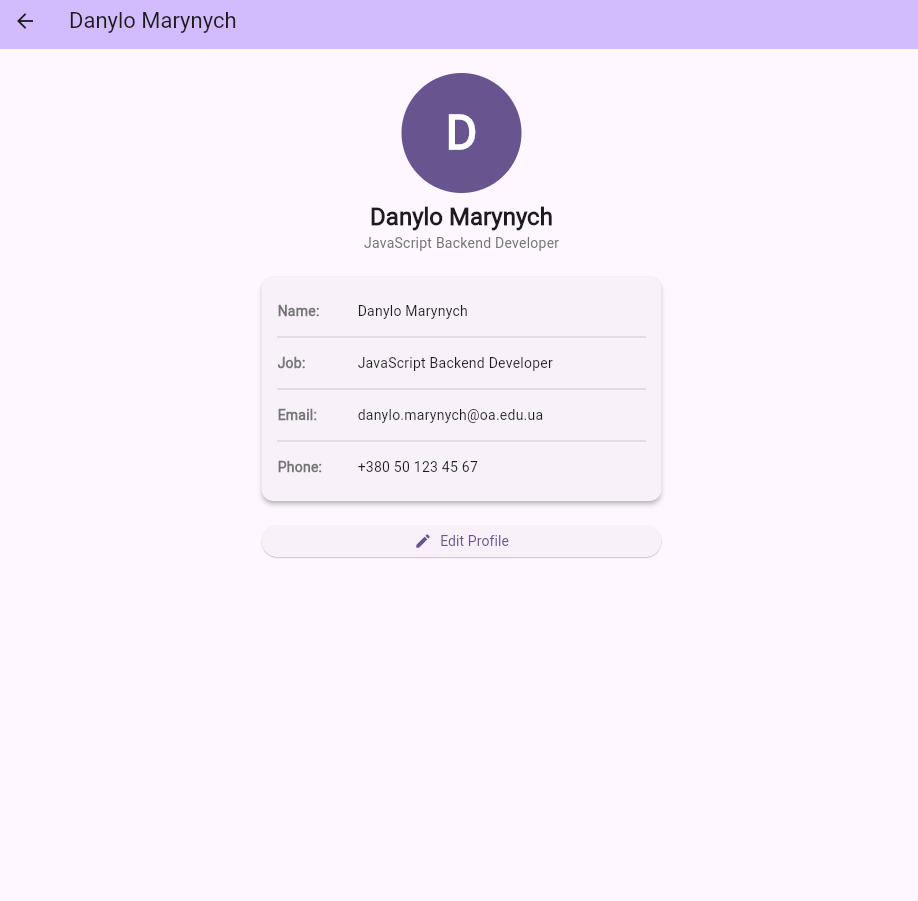
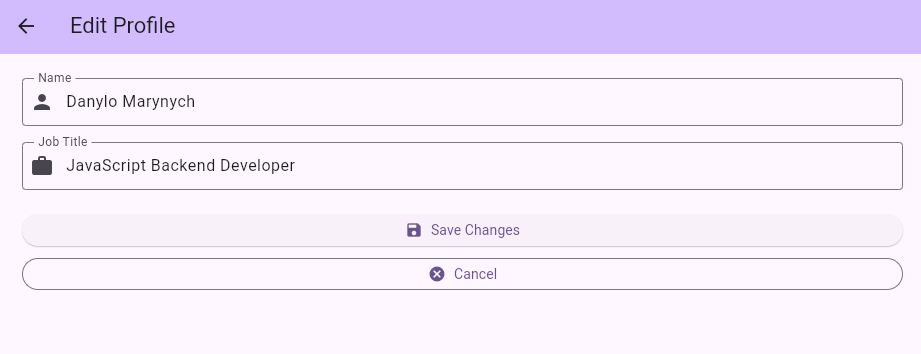

# Лабораторна робота №4: User Directory
**Виконав:** Маринич Данило

---

## 📱 Про проєкт
Цей застосунок є реалізацією каталогу користувачів з навігацією між трьома екранами та передачею даних між ними. Основний акцент зроблено на правильній роботі з Navigator та архітектурі стану.

### Виконані вимоги:
- ✅ Створено модель `User` з полями та методом `copyWith`.
- ✅ Реалізовано Home Screen зі списком користувачів через `ListView.builder`.
- ✅ Реалізовано Profile Screen з відображенням деталей користувача.
- ✅ Реалізовано Edit Screen з `TextEditingController` та поверненням результату через `Navigator.pop(updatedUser)`.
- ✅ **Варіант A:** Навігація через Named Routes (`pushNamed`, `onGenerateRoute`).
- ✅ **Варіант B:** Кастомна анімація переходу (`PageRouteBuilder` + `SlideTransition`).
- ✅ **Варіант C:** `Hero` анімація аватара між Home Screen і Profile Screen.

---

## 🏗 Архітектура проєкту
Проєкт організовано за **Feature-based** підходом (продовження стилю LR03):

- `lib/core/` — глобальні налаштування (тема застосунку).
- `lib/features/directory/models/` — структури даних (`User`, `sampleUsers`).
- `lib/features/directory/screens/` — екрани (`HomeScreen`, `ProfileScreen`, `EditScreen`).
- `lib/features/directory/widgets/` — reusable віджети (`UserListTile`, `InfoRow`).

---

## 🎓 Відповіді на питання

**1. Яка різниця між `push()` та `pushNamed()`?**  
`push()` приймає готовий `Route` об'єкт напряму. `pushNamed()` приймає рядок-маршрут і шукає відповідний екран в `MaterialApp` через `routes` або `onGenerateRoute`. `pushNamed` зручніший при великій кількості екранів.

**2. Як передати дані на наступний екран?**  
Через конструктор: `ProfileScreen(user: user)`. При `pushNamed` — через параметр `arguments`, а на приймаючому боці дістаємо через `settings.arguments`.

**3. Навіщо `await` перед `Navigator.push()`?**  
`Navigator.push<T>()` повертає `Future<T?>`. `await` зупиняє виконання до повернення з екрану і дає змогу отримати результат переданий через `pop(result)`.

**4. Що робить `Navigator.pop(result)`?**  
Закриває поточний екран і повертає `result` як значення `Future` що чекав попередній екран. Без аргументу — повертає `null`.

---

## 📸 Скріншоти

